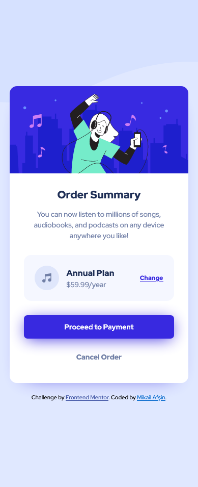
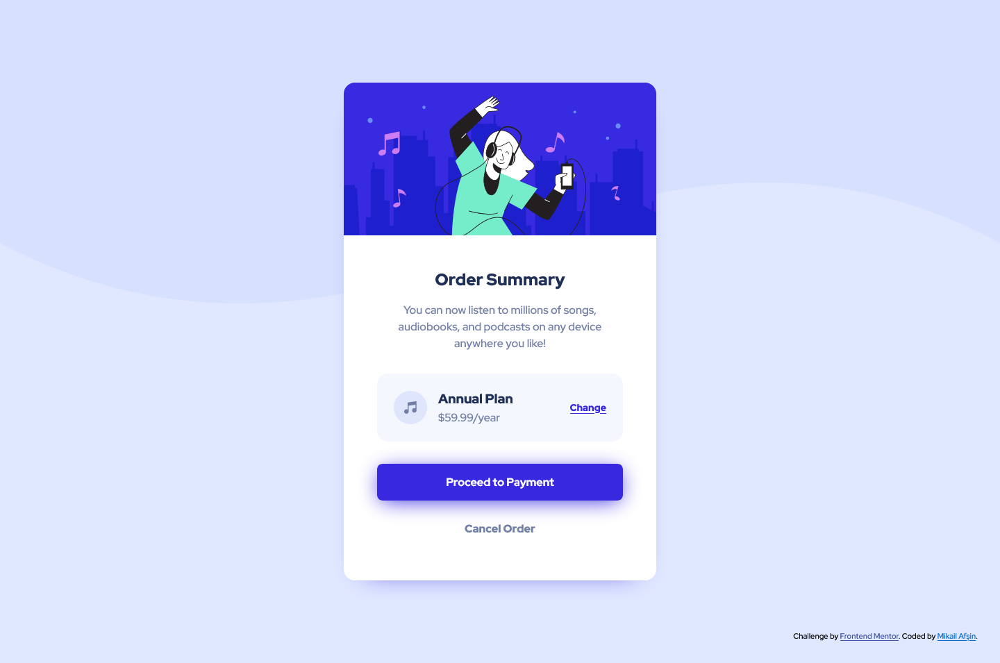

# Frontend Mentor - Order summary card solution

This is a solution to the [Order summary card challenge on Frontend Mentor](https://www.frontendmentor.io/challenges/order-summary-component-QlPmajDUj).

## Table of contents

- [Overview](#overview)
  - [The challenge](#the-challenge)
  - [Screenshot](#screenshot)
  - [Links](#links)
- [My process](#my-process)
  - [Built with](#built-with)
  - [What I learned](#what-i-learned)
  - [Continued development](#continued-development)
  - [Useful resources](#useful-resources)
- [Author](#author)

## Overview

### The challenge

Users should be able to:

- See hover states for interactive elements

### Screenshot

**Mobile**


**Desktop**


### Links

- Solution URL: [GitHub](https://github.com/mikailafsin/frontend-mentor-order-summary-component-solution)
- Live Site URL: [Vercel](https://frontend-mentor-order-summary-component-solution.vercel.app)

## My process

### Built with

- HTML5 markup
- CSS custom properties
- Flexbox
- Mobile-first workflow
- [Sass](https://sass-lang.com) - CSS pre-processor
- [BEM](https://getbem.com) - Naming methodology

### What I learned

In this challenge, as I mentioned in the previous challenge, "I should use the BEM naming methodology as well as the Sass pre-processor." I made my thought come true. I learned the BEM naming logic and used it with the Sass pre-processor in this project.

A few Sass pre-processor codes along with BEM naming methodology:

```html
<div class="card-plan">
  <div class="card-plan__content">
      
      <div class="card-plan__plan-type">
          <h3 class="card-plan__name">Annual Plan</h3>
          <p class="card-plan__price">$59.99/year</p>
      </div>
  </div>
  <a href="#" class="card-plan__link">Change</a>
</div>
```
```scss
.card-plan {
  display: flex;
  align-items: center;
  justify-content: space-between;
  background-color: $veryPaleBlue;
  border-radius: 1rem;
  padding: 1.5rem;
  margin-bottom: 2rem;

  &__content {
    display: flex;
    align-items: center;
    gap: 1rem;
  }

  &__name {
    color: $darkBlue;
    font-weight: 900;
    margin-bottom: .25rem;
  }

  &__price {
    color: $desaturedBlue;
  }

  &__link {
    color: $brightBlue;

    font: {
      size: .875rem;
      weight: 900;
    }

    &:hover {
      text-decoration: none;
      opacity: .8;
    }
  }
}
```

### Continued development

In future projects, I will focus on using all the techniques that I used to solve this challenge and further developing these techniques.

### Useful resources

- [BEM Official Website](https://getbem.com/introduction) - This official BEM website allowed me to add new information to my knowledge about BEM. At the same time, I found answers to possible questions that came to my mind by examining the frequently asked questions.

- [BEM Css YouTube Tutorial](https://www.youtube.com/watch?v=er1JEDuPbZQ) - This tutorial helped me gain more control over BEM Css.

## Author

- Frontend Mentor - [@mikailafsin](https://www.frontendmentor.io/profile/mikailafsin)
- Instagram - [@mikail.afsin](https://www.instagram.com/mikail.afsin)